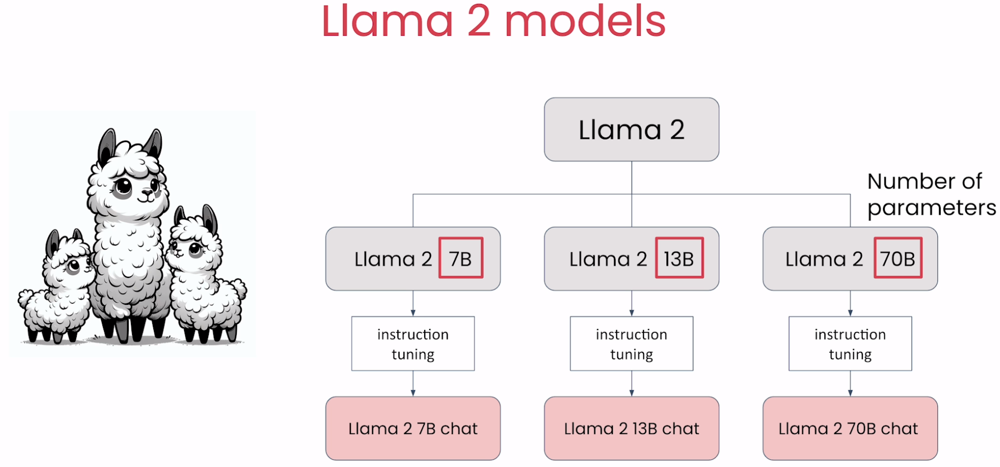
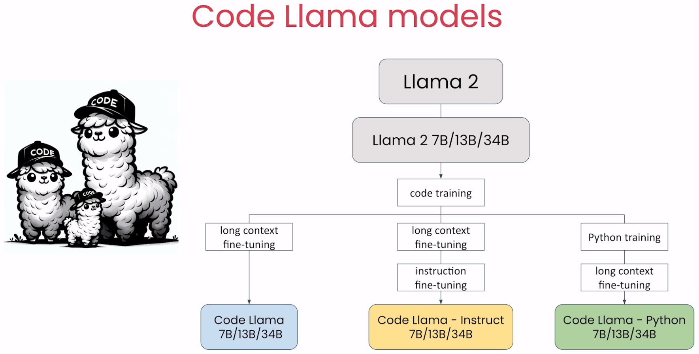
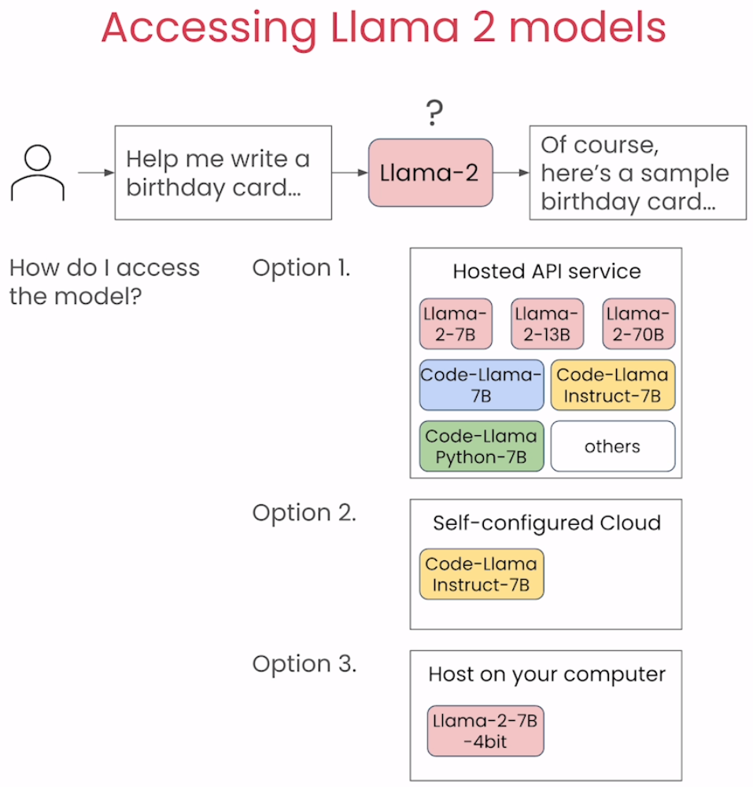
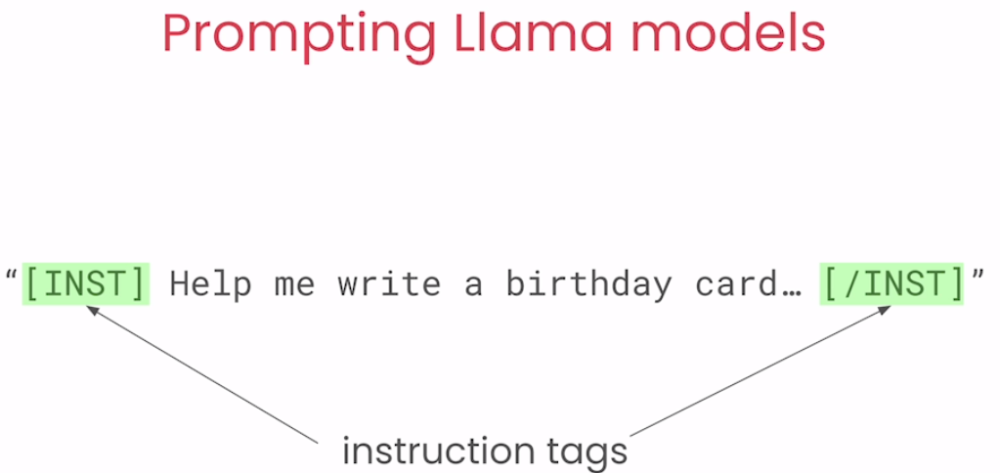

# 🚀 [Prompt Engineering with Llama 2](https://www.deeplearning.ai/short-courses/prompt-engineering-with-llama-2/)

💻 Welcome to the "Prompt Engineering with Llama 2" course! Instructed by Amit Sangani, Senior Director of Partner Engineering at Meta, this course will guide you through best practices for prompting and building applications with the powerful open commercial license models of Llama 2.

 
 

## Course Summary
In this course, you'll delve into best practices for prompting and utilizing the powerful Llama 2 collection of models. Here's what you can expect to learn and experience:

1. 🤖 **Prompt Engineering Techniques**: Learn best practices for prompting and selecting among the Llama 2 models.

 
 

2. 🌐 **Model Interaction**: Interact with Meta Llama 2 Chat, Code Llama, and Llama Guard models.
3. 🛡️ **Safe and Responsible AI**: Promote safe and responsible use of LLMs by utilizing the Llama Guard model.
4. 🔄 **Advanced Prompt Engineering**: Experiment with advanced prompt engineering techniques, like few-shot prompting and chain-of-thought prompting.

## Key Points
- 🔎 Learn best practices specific to prompting Llama 2 models.
- 🤖 Interact with Meta Llama 2 Chat, Code Llama, and Llama Guard models.
- 🛡️ Build safe, responsible AI applications using the Llama Guard model.

## About the Instructor
🌟 **Amit Sangani** is the Senior Director of Partner Engineering at Meta, bringing extensive expertise to guide you through best practices in prompt engineering with Llama 2.

🔗 To enroll in the course or for further information, visit [deeplearning.ai](https://www.deeplearning.ai/short-courses).
